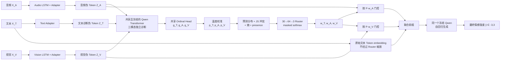

# 冲突—不确定性感知的 MSE Router V2：架构与研究故事

> 实现名称：`natural_text_residual_gated_audio_vision_v2`  
> 当前任务：CMU-MOSEI 多模态情感强度回归，输出范围为 `[-3, 3]`  
> 骨干模型：冻结的 Qwen-1.8B  
> 本文档对应 `mse_router/model.py`、`mse_router/trainer.py` 和
> `scripts/run_qwen_mosei_router.py` 中的当前实现。

## 一句话概括

文本、音频和视觉先分别通过同一个冻结 LLM“表态”；模型根据三者的预测、
两两冲突、各自不确定性和模态是否存在，学习每个样本应该相信谁；最终保留
原始文本 Token 作为语义主干，只对音频和视觉伪 Token 进行动态门控，再由
同一个冻结 LLM 生成最终情感分数。

这是一条“先诊断、再路由、最后融合”的路径，而不是对三个最终预测做简单
加权平均。

## 1. 我们的故事：从“让 LLM 看见多模态”到“让 LLM 知道该相信谁”

### 1.1 起点：MSE-Adapter 解决了模态接口问题

LLM 原生理解文本 Token，却不能直接理解连续的语音特征和视觉特征。
MSE-Adapter 的核心价值是用轻量 Adapter 把外部模态映射成与 LLM
词向量同维度的伪 Token，从而在冻结 LLM 的条件下完成多模态任务。

这解决了第一个问题：

> 如何让音频和视觉进入 LLM？

但真实的多模态情感并不总是协调一致。文字可能是正面的，语气却带有讽刺；
人脸可能被遮挡；背景噪声可能污染音频；某一种模态也可能完全缺失。如果所有
模态始终以固定方式融合，模型就没有显式机制判断某条证据是否值得信任。

### 1.2 核心问题：能进入 LLM，不等于应该被同等相信

我们的出发点是把三种模态看成三个“证人”：

- 文本提供字面语义；
- 音频提供语气、节奏和强弱；
- 视觉提供表情和行为信号。

证人之间可能一致，也可能冲突；一个证人还可能对自己的判断很犹豫。因此只看
最大置信度不够，只看模态间冲突也不够：两个模态可能一致但都很不确定，一个
受噪声影响的模态也可能非常自信。

我们的关键想法是：

> 先让每种模态在统一的冻结 LLM 语义空间中独立作出判断，再同时利用“它说了
> 什么”“它有多确定”“它和别人是否冲突”来分配可信度。

这把研究重点从“表示对齐”推进到了“证据可靠性建模”。

### 1.3 V1：完整概念正确，但文本被压缩得过度

第一版实现让文本、音频和视觉都被压缩为 4 个伪 Token，然后 Router 对三组
伪 Token 一起门控，再交给 LLM 生成结果。它忠实实现了“模态先表态，再动态
融合”的概念，但忽略了一个重要的不对称性：

> 文本本来就是 LLM 最擅长的输入，把完整文本压缩成 4 个伪 Token，相当于
> 主动丢弃了词序、否定、修饰关系和细粒度语义。

V1 前四轮验证结果的 MAE 约为 `0.78–0.81`，Corr 只有
`0.02–0.23`。训练损失可以下降，但预测与真实标签几乎不相关。这说明问题不在
“有没有梯度”，而在最终输入的信息瓶颈：Router 学会了分配权重，却没有足够
完整的文本语义可供最终 LLM 推理。

### 1.4 V2：文本是语义锚点，音视频是动态证据

V2 保留三模态伪 Token 诊断，因为 Router 仍然需要三种模态在同一空间中的
独立意见；但在最终预测分支中作了关键改变：

- 原始文本 Token 直接保留，作为稳定的语义残差路径；
- 音频和视觉仍通过伪 Token 接入，并由 Router 动态放大或抑制；
- 文本权重不再乘到原始文本 Token 上，而是表达“相对于文本主干，应该加入多少
  音视频证据”。

因此，当前方法的故事不是“三个模态完全对称地竞争”，而是：

> 让文本保住 LLM 的语言优势，再让经过可靠性诊断的声音和画面修正、补充或
> 反驳文字。

截至 2026-09-03、seed 1111 的阶段一验证快照，V2 在第 6 轮达到
`MAE=0.5255`、`Corr=0.7466`，明显优于 V1。这仍是单 seed、验证集和训练中间
结果，不能替代最终测试集与五 seed 汇总，但它支持了“保留自然文本语义主干”
这一修改方向。

## 2. 总体架构



图中“诊断 LLM”和“最终 LLM”不是两个独立模型。代码只加载一份
Qwen-1.8B，四次调用共享完全相同的冻结参数：三种模态的诊断在 batch 维合并
为一次 Transformer 前向，最终融合再进行一次生成前向。

## 3. 架构细节

### 3.1 三个独立 Adapter 与伪 Token

设 LLM 隐藏维度为 `h=2048`，每种模态产生 `M=4` 个伪 Token。

#### 文本诊断路径

文本 Token ID 先经过冻结 Qwen 的输入嵌入层，得到完整 Token 表示。随后使用
带 mask 的注意力池化，再经过 `Linear(2048,256)+GELU`：

\[
f_T=\operatorname{GELU}(W_T\operatorname{AttnPool}(E(X_T)))
\]

`f_T` 仅用于生成文本的**诊断伪 Token**。原始文本序列还会通过另一条残差路径
直接进入最终预测。

#### 音频和视觉路径

音频、视觉序列分别经过支持变长序列的单层 LSTM：

\[
f_A=\operatorname{Proj}(\operatorname{LSTM}_A(X_A)),\qquad
f_V=\operatorname{Proj}(\operatorname{LSTM}_V(X_V))
\]

当前音频 LSTM 隐藏维度为 64，视觉 LSTM 隐藏维度为 32；二者最终都投影为
256 维特征。

#### 独立的多尺度投影器

每种模态拥有独立的 `MultiScaleProjector`。它包含三条带 GELU 的投影支路，
经过卷积整合后映射到 2048 维，再扩展成 4 个伪 Token：

\[
Z_m=A_m(f_m)\in\mathbb{R}^{4\times 2048},
\qquad m\in\{T,A,V\}
\]

三种模态还分别加上一个可学习的模态类型向量。若模态缺失，presence mask 会把
对应伪 Token 置零。

### 3.2 独立语义诊断与共享 Ordinal Head

每组伪 Token 分别组成如下诊断输入：

\[
[\mathrm{BOS};\langle\mathrm{Multimodal}\rangle;Z_m;
\langle/\mathrm{Multimodal}\rangle;P_{diag}]
\]

它们经过共享的冻结 Qwen Transformer。最后位置的隐藏状态进入共享的七分类
Ordinal Head：

```text
LayerNorm(2048)
→ Linear(2048, 256)
→ GELU
→ Dropout(0.1)
→ Linear(256, 7)
```

七个类别锚点为：

\[
\mathcal A=\{-3,-2,-1,0,1,2,3\}
\]

连续标签不会被粗暴取整，而是在相邻锚点之间线性插值得到 soft ordinal target。
例如 `y=1.4` 对锚点 1 和 2 的目标权重分别为 0.6 和 0.4。

### 3.3 温度校准、冲突和不确定性

对每个模态的七维 logits 使用独立温度：

\[
p_m=\operatorname{softmax}(g_m/\tau_m)
\]

温度不是与主训练一起任意漂移，而是在阶段一结束后，使用独立校准子集最小化
soft NLL 拟合，并约束在 `[0.05,10]`。

三对模态冲突采用归一化 Jensen–Shannon 散度：

\[
C_{TA}=\frac{JS(p_T,p_A)}{\log 2},\quad
C_{TV}=\frac{JS(p_T,p_V)}{\log 2},\quad
C_{AV}=\frac{JS(p_A,p_V)}{\log 2}
\]

每个模态的不确定性采用归一化熵：

\[
U_m=\frac{-\sum_{k=1}^{7}p_{m,k}\log p_{m,k}}{\log 7}
\]

因此冲突和熵都被缩放到 `[0,1]`。冲突回答“谁与谁意见不一致”，熵回答
“每个模态对自己的意见有多犹豫”。

### 3.4 Router 的 30 维输入

Router 的样本级特征为：

\[
s=[p_T,p_A,p_V,C_{TA},C_{TV},C_{AV},U_T,U_A,U_V,r_T,r_A,r_V]
\]

维度组成如下：

| 信息 | 维度 |
|---|---:|
| 三个七分类概率分布 | 21 |
| 三个两两 JS 冲突 | 3 |
| 三个归一化熵 | 3 |
| 三个 presence 标志 | 3 |
| 合计 | 30 |

Router 网络为：

```text
Linear(30, 64)
→ GELU
→ Dropout(0.1)
→ Linear(64, 3)
→ presence-aware masked softmax
```

最后一层以全零初始化，因此训练开始时对所有存在的模态均匀分配权重。缺失模态
在 masked softmax 后严格得到零权重，其余权重重新归一化，满足：

\[
w_T+w_A+w_V=1
\]

Router 输入在代码中执行 `detach()`。这使最终生成损失不能通过 Router 特征
反向操纵诊断概率；诊断头主要由显式的 ordinal 辅助监督训练，Router 学习的是
如何使用已经形成的诊断信号。

### 3.5 V2 的最终融合：只门控音频和视觉

令当前样本实际存在的模态数为：

\[
P=r_T+r_A+r_V
\]

最终分支只保留音频和视觉伪 Token，并使用：

\[
\widetilde Z_A=P\,w_AZ_A,\qquad
\widetilde Z_V=P\,w_VZ_V
\]

乘以 `P` 是为了保持均匀路由时的单位尺度：若三个模态都存在且
`w_m=1/3`，则 `P w_m=1`，伪 Token 不会仅因为引入 Router 就整体缩小。

文本权重 `w_T` 虽然不直接乘到原始文本 Token 上，但仍然有实际作用：当
Router 更相信文本时，`w_A` 和 `w_V` 会因 softmax 竞争而下降，从而减少外部
音视频证据相对于文本主干的影响。

最终输入前缀为：

\[
[\mathrm{BOS};\langle\mathrm{Multimodal}\rangle;
\widetilde Z_A;\widetilde Z_V;
\langle/\mathrm{Multimodal}\rangle;E(X_T);P_{task}]
\]

其中 `E(X_T)` 是冻结 Qwen 对原始文本 Token 的逐 Token 嵌入，而不是文本
Adapter 的四个伪 Token。音频、视觉或文本缺失时，对应位置通过 attention mask
真正移出注意力图。position IDs 由 mask 的累积和生成，以正确处理左 padding 和
缺失模态。

### 3.6 最终输出

最终融合序列进入同一个冻结 Qwen，由语言模型自回归生成最多 4 个 Token，目标
格式为带符号的一位小数，例如 `+1.4`。评估时解析生成文本中的第一个数字：

- 合法范围是 `[-3,3]`；
- 无法解析或超出范围时回退为 0；
- invalid 和 out-of-range 数量单独记录，不能被静默忽略。

所以当前最终结果确实由 LLM 直接生成；最终 LLM 后没有额外回归 MLP。
Ordinal Head 位于**诊断分支**的 LLM 隐藏状态之后，作用是为 Router 提供结构化
模态意见，而不是替代最终生成。

## 4. 训练流程

### 阶段一：共同建立“表态能力”和初始路由

训练以下模块：

- 文本、音频、视觉 Adapter；
- 音频和视觉 LSTM；
- 模态类型向量；
- 七分类 Ordinal Head；
- Router。

Qwen-1.8B 始终冻结，但梯度仍穿过它回传到输入侧模块。损失为：

\[
\mathcal L_{stage1}=\mathcal L_{gen}+0.3\mathcal L_{ordinal}
\]

`generation loss` 是最终数字字符串的语言模型交叉熵；`ordinal loss` 是三个存在
模态上的 soft-target 交叉熵平均值。这里没有使用均方误差损失，“MSE-Adapter”
中的 MSE 是方法名称的一部分，不代表当前训练在处理 Token 时使用 MSE loss。

阶段一最多 40 轮，以验证 MAE 保存最佳 checkpoint，patience 为 10。第 4 轮还
有防塌缩质量门：仅当 `MAE>0.72` 且 `Corr<0.30` 同时发生时终止当前方案。

### 阶段二：独立温度校准

从原训练集划出约 10% 作为校准集，并按视频组隔离，避免同一视频片段跨训练和
校准集合泄漏；同时按最近情感锚点分层。当前划分为：

- 优化集：14,678 个样本、2,027 个视频组；
- 校准集：1,648 个样本、222 个视频组。

分别拟合 `tau_T`、`tau_A`、`tau_V`。若优化失败、温度触边、出现非有限值，或
校准后 NLL 变差，训练链会停止，不让不可信概率继续驱动 Router。

### 阶段三：只训练 Router

加载阶段一的最佳 checkpoint 和固定温度，冻结 Adapter、LSTM、Ordinal Head
及 Qwen，只用生成交叉熵微调 Router：

\[
\mathcal L_{router}=\mathcal L_{gen}
\]

该阶段最多 10 轮，patience 为 3。其目的是在模态表态和概率尺度稳定后，单独
学习“最终应该相信谁”。

### 优化与数值设置

- 优化器：`AdamW`，不是普通 Adam；
- Adapter 学习率：`5e-3`；
- Head/Router 学习率：`1e-3`；
- weight decay：`0.01`；
- Adam epsilon：`1e-4`；
- cosine schedule，10% warmup；
- microbatch：4；梯度累积：4；有效 batch：16；
- 梯度裁剪：1.0；
- FP16 autocast 与动态 GradScaler；
- 主要非线性激活：GELU；Router 输出使用 masked softmax。

### 训练期模态扰动

为了让 Router 真正见过“不可靠证据”，训练时进行样本级扰动：

- 30% 概率随机丢弃三种模态中的一种；
- 20% 概率给存在的音频加入 `5–20 dB` 随机噪声；
- 20% 概率遮盖视觉有效序列中连续 `10%–30%` 的片段。

最终测试除 clean 条件外，还评估缺失文本/音频/视觉、音频 SNR 为 20/10/0 dB，
以及视觉遮盖 25%/50%/75% 等条件。

## 5. 当前验证证据与边界

### V1：全模态伪 Token 门控

| Epoch | MAE ↓ | Corr ↑ |
|---:|---:|---:|
| 1 | 0.7763 | 0.0328 |
| 2 | 0.7769 | 0.0170 |
| 3 | 0.7953 | 0.1059 |
| 4 | 0.8085 | 0.2299 |

### V2：自然文本残差 + 音视频门控

| Epoch | MAE ↓ | Corr ↑ |
|---:|---:|---:|
| 1 | 0.6283 | 0.6135 |
| 2 | 0.5565 | 0.6772 |
| 3 | 0.5792 | 0.6931 |
| 4 | 0.5492 | 0.7141 |
| 5 | 0.5776 | 0.7061 |
| 6 | **0.5255** | **0.7466** |

这些数字支持 V2 的设计动机，但正式结论必须等待：

1. 阶段一早停、温度校准和 Router-only 阶段全部完成；
2. 独立测试集结果；
3. 五个随机种子的均值与标准差；
4. `uniform`、`no_conflict`、`no_uncertainty` 等消融实验；
5. clean 与缺失/噪声条件下的鲁棒性比较。

在这些实验完成前，准确的表述应是“早期验证结果支持自然文本残差设计”，而不
应表述为已经达到最终性能或超过现有最佳方法。

## 6. 消融版本

代码预留了以下 Router 版本，用于拆解性能来源：

| 版本 | Router 使用的信息 |
|---|---|
| `full` | 预测分布 + JS 冲突 + 熵 + presence |
| `no_conflict` | 移除三项 JS 冲突 |
| `no_uncertainty` | 移除三项熵 |
| `predictions_only` | 只保留预测分布和 presence |
| `uncertainty_only` | 只保留熵和 presence |
| `uniform` | 不学习 Router，对存在模态均匀赋权 |

最重要的论文验证不是只证明 `full` 能工作，而是回答：冲突是否提供了熵之外的
增益、熵是否提供了预测分布之外的增益，以及动态路由是否比均匀融合更能抵抗
模态污染。

## 7. 当前架构不是什么

- **不是三个独立 LLM**：诊断和最终生成共享同一份冻结 Qwen 参数。
- **不是 late fusion**：权重作用在最终 LLM 之前的音视频 Token 表示上，而不是
  对三个最终概率求加权平均。
- **不是对 Qwen 做全量微调或 LoRA**：Qwen 参数始终冻结。
- **不是最终 LLM 后接回归网络**：最终分数由 Qwen 直接生成；MLP Head 只服务
  于诊断和路由。
- **不是 MSE loss**：当前目标是生成交叉熵与 soft ordinal 交叉熵。
- **不是完全对称融合**：V2 明确把自然文本作为语义锚点，把音视频作为动态证据。

## 8. 论文式方法表述

可以将当前方法概括为：

> 我们提出一种面向冻结大语言模型的冲突—不确定性感知多模态路由框架。该框架
> 首先通过独立轻量 Adapter 将文本、音频和视觉映射为统一的伪 Token，并利用
> 共享冻结 LLM 和序数预测头获得模态级情感分布。随后，以温度校准后的预测分布、
> 两两 Jensen–Shannon 散度、概率熵及模态可用性共同刻画样本级证据可靠性，
> 通过轻量 Router 生成动态模态权重。为避免伪 Token 压缩破坏 LLM 原生语言
> 能力，最终融合保留原始文本 Token 作为语义残差，仅对音频和视觉伪 Token
> 执行动态门控，再由同一冻结 LLM 生成情感强度。该设计将多模态适配从静态表示
> 对齐扩展为诊断驱动的可靠性路由，并面向模态冲突、噪声与缺失场景进行优化。

## 9. 代码对应关系

| 内容 | 文件/入口 |
|---|---|
| Adapter、诊断分支、Router、V2 最终前缀 | `mse_router/model.py` |
| JS、熵、soft ordinal target、masked softmax | `mse_router/math_utils.py` |
| 校准划分、模态扰动、鲁棒性条件 | `mse_router/data.py` |
| 三阶段训练、AdamW、早停、质量门、评估 | `mse_router/trainer.py` |
| 实验配置、预检、训练与多 seed 汇总 | `scripts/run_qwen_mosei_router.py` |
| Slurm 训练入口 | `scripts/qwen_mosei_router.slurm` |
| 当前实验输出 | `outputs/qwen-mosei-router-v2/` |

