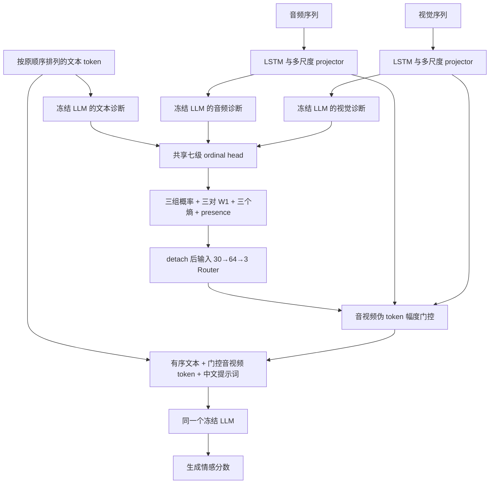

# 版本说明：CH-SIMS 多骨干 Wasserstein Router V4

整理日期：2026-09-12。版本标识：`sims_backbone_lr1e3_d00_sat3090_20260912`。

## 版本定位与来源

这是 `mse router new conflict` 项目的一份独立实验快照，架构标识为
`ordered_text_diagnostics_wasserstein_router_v4`，冲突指标为
`wasserstein_1_normalized`，运行时 `router_variant=full`。

本实验以 `sims_lr1e3_d00_testf1_three_seeds_20260910` 的 ChatGLM3 SIMS 配置为基线，
保留数据、中文提示词、损失、训练器和路由设置，把冻结语言模型及 tokenizer 分别替换为：

| `--target` | 语言模型 | 隐藏维度 | Transformers |
| --- | --- | ---: | --- |
| `qwen18` | Qwen-1_8B | 2048 | 4.36.1 |
| `llama2` | Llama-2-7b-hf | 4096 | 4.36.1 |
| `llama32` | Llama-3.2-3B | 3072 | 4.44.2 |

Llama tokenizer 没有 padding token 时使用 EOS ID；Llama 3.2 显式使用 eager attention。
各模型的 projector 和 ordinal head 按实际隐藏维度构造，并非形状完全相同的参数化模型。
ChatGLM3 是配置和数据加载器的来源，本次迁移任务是表中三个骨干、每个三个种子，共九次训练。

归档源码来自本地 `mse router new conflict/revisions/` 下的同名目录。
8 份已启动训练的 manifest 中，各自记录的 17 个来源文件哈希均与归档匹配；
第九个任务在核对时尚未启动，没有训练 manifest。
核对详情、时间、环境和逐文件 SHA-256 见
[`provenance/source_snapshot.json`](provenance/source_snapshot.json)。
其中 `upstream_git_commit` 是 **MSE-Adapter 上游仓库**的 commit，不能视为整个 Router 实验的 Git 版本。

## 模型结构



- 文本直接以自然 token 序列进入诊断与最终生成路径，保留词序，不压缩成文本伪 token。
- 音频和视觉分别用长度感知 LSTM 编码到 256 维，再经多尺度 projector 各产生 4 个伪 token。
- 三个模态共用一个 ordinal head，输出七个有序情感锚点上的概率。
  锚点为 `[-1, -2/3, -1/3, 0, 1/3, 2/3, 1]`。
- Router 输入共 30 维：21 个概率、3 个冲突、3 个归一化熵、3 个 presence 标记。
  配对顺序是文本–音频、文本–视觉、音频–视觉；缺失模态对应的冲突置零。
- Router 为 `Linear(30,64) → GELU → Dropout(0) → Linear(64,3)`，末层零初始化，
  用 masked softmax 输出在场模态的权重。输入统计量经过 `detach()`。
- 最终前缀中音视频伪 token 的缩放系数为 `在场模态数 × 对应权重`，
  自然文本保留直接路径；文本权重通过归一化竞争影响音视频权重，并不直接乘到文本 embedding 上。

两个模态分布 `p, q` 的冲突为：

```text
conflict(p,q) = Σ[k=0..5] |CDF_p[k] - CDF_q[k]| × (anchor[k+1] - anchor[k])
                / (anchor[6] - anchor[0])
```

这是使用有序锚点距离的归一化一维 Wasserstein-1，本版本分母为 2。
实际路由使用 W1；代码中保留的 JS 工具不是本实验的冲突计算路径。
旧 V3/JS checkpoint 不兼容 V4 标记。

## 数据与预处理

| 项目 | 实际设置 |
| --- | --- |
| 数据集 | CH-SIMS，非对齐特征 |
| 原始 train / valid / test | 1368 / 456 / 457 |
| 实际参与优化的训练样本 | 1233 |
| 从训练集保留的 calibration 样本 | 135，本版本未执行温度拟合 |
| 优化 / 保留视频组数 | 54 / 6 |
| 分组划分随机种子 | 20260903 |
| 文本 / 音频 / 视觉序列长度 | 50 / 400 / 55 |
| 音频 / 视觉特征维度 | 33 / 709 |
| 情感取值范围 | [-1, 1] |

数据加载仍调用 `build_router_dataloaders()`，按视频组隔离、按标签分层从训练集保留约 10%。
因此关闭温度校准不等于使用全部 1368 条样本优化。valid 集存在于加载器中，
本版本的 `fit()` 使用 test 集选择 checkpoint。

使用的派生特征文件为 `unaligned_39_router_fp16_safe.pkl`：
在视觉维度 288、289、290 上将绝对值大于 10000 的元素置零。
train / valid / test 分别替换 2319 / 1116 / 558 个元素。
文件大小为 1,228,189,354 字节，SHA-256：

```text
cc26ab4c1128cd58ebfb2b8ecfc32ab8088587f89abb2f467760298035118b20
```

原始数据路径、原始哈希和处理规则记录于 [`configs/sims.json`](configs/sims.json)。
归档未包含数据；要严格复现实验，应使用通过该哈希检查的派生文件。

最终提示词为“请对上述多模态内容的情感强度进行预测，范围在[-1.0, 1.0]之间。响应: 情感为”；
诊断提示词为“请预测该模态的情感强度，范围为-1到+1。”。

## 训练和评估协议

| 参数 | 值 |
| --- | --- |
| 随机种子 | 1111、1113、1115 |
| 训练方式 | 单阶段联合训练；每次独立训练使用一张 GPU |
| 冻结参数 | 语言模型全部参数、温度参数 |
| 可训练参数 | 音视频 LSTM/projector、模态 embedding、ordinal head、Router |
| Adapter / head 与 Router 学习率 | 0.001 / 0.001 |
| 优化器 | AdamW，weight decay 0.01，epsilon 0.0001 |
| 学习率调度 | cosine，10% warmup |
| microbatch / 梯度累积 / 有效 batch | 4 / 4 / 16 |
| 训练轮数 | 40；patience 41；quality gate 关闭 |
| dropout | 0.0 |
| 梯度裁剪 | 1.0 |
| 精度 | FP16 autocast、GradScaler、gradient checkpointing |
| 每个音视频模态的伪 token 数 | 4 |
| 最大生成 token 数 | 4 |
| 温度校准 | 关闭，温度保持 1 |

损失是 `生成交叉熵 + 0.3 × ordinal 辅助交叉熵`。
辅助目标由连续标签在相邻有序锚点上插值得到，在在场模态上求平均。
生成监督将标签限制到 [-1,1] 后格式化为带符号的一位小数字符串。

**dropout 为零不代表没有训练增强。** `augment_modalities()` 保留以下扰动：

- 每条样本以 0.30 概率随机屏蔽一个模态；
- 在音频在场时以 0.20 概率加入 5–20 dB SNR 噪声；
- 在视觉在场时以 0.20 概率屏蔽 10%–30% 的连续帧区间。

只运行联合训练，未运行单独的 Router 微调或噪声/缺失模态测试。
每轮在干净 **test** 集计算 `F1_score`，从完整 40 轮中选最大值，平分取最早轮次；
最终再次评估所选模型。这个选择规则会使用测试标签，报告结果时必须标明 **test-selected**，
不能与通过验证集选模、测试集只评估一次的协议混为一谈。

## 代码目录与调用关系

| 路径 | 作用 |
| --- | --- |
| `scripts/run_transfer_sims.py` | 实际入口；选择骨干、替换模型类和 hidden size、处理 padding |
| `scripts/run_chatglm3_sims.py` | 读取 SIMS 配置并覆盖运行器、训练参数 |
| `scripts/run_backbone_mosei_router.py` | 继承的骨干配置和来源记录逻辑 |
| `scripts/run_qwen_mosei_router.py` | 继承的 preflight、train、aggregate 运行器 |
| `mse_router/model.py` | Qwen 实现、编码器、projector、Router、损失与生成 |
| `mse_router/backbone_model.py` | Llama / ChatGLM 的冻结模型适配 |
| `mse_router/math_utils.py` | W1、熵、masked softmax、ordinal 目标 |
| `mse_router/sequence.py` | padding 整理与标签对齐 |
| `mse_router/data.py` | 分组数据划分与训练增强 |
| `mse_router/trainer.py` | 联合训练、test F1 选模、checkpoint 和评估 |
| `configs/sims.json` | 原始基线配置与数据规格 |
| `upstream_adapter/MSE-ChatGLM3-6B/` | 实际依赖的上游配置、加载器、指标和来源检查文件 |
| `provenance/original_revision/` | 原始 README、launch spec、CPU 检查及提交观察记录 |
| `provenance/source_snapshot.json` | 归档哈希与训练 manifest 一致性记录 |

调用链为 `run_transfer_sims → run_chatglm3_sims → run_backbone_mosei_router → run_qwen_mosei_router`。
继承文件名中的 MOSEI/Qwen 不代表最终训练的数据集或骨干。
`configs/sims.json` 中的 ChatGLM `model_path` 和旧 `output_root` 是基线值，
由迁移入口的 target 默认值或命令行覆盖；不要仅凭 JSON 中这两个字段判断实际任务。

上游来源为 `AZYoung233/MSE-Adapter` 的
`e0617fec510b2f2c4539e7f8b000efb3dbd98740`，附带代码保留原许可证。
归档只复制本版本所需的上游模块；泛用 MOSEI/Llama/ChatGLM 入口的其他运行组合不属于本归档的复现范围。

## 复现步骤

1. 进入本版本目录，执行 `python tools/verify_snapshot.py` 核对源码。
2. 准备 Python 3.10 环境：Qwen/Llama 2 对应 `requirements-qwen-llama2.txt`，
   Llama 3.2 对应 `requirements-llama32.txt`。文件记录实际环境中的直接及支持依赖版本，
   不是包含所有传递依赖的完整锁文件，也未在全新机器上验证安装。
   原运行环境为 Python 3.10.12、PyTorch 2.0.1、CUDA 11.7、RTX 3090。
3. 准备原实验匹配的本地模型/tokenizer 文件以及上述派生 SIMS 文件。
4. 在有效的单 GPU Slurm allocation 内，使用绝对路径设置以下变量后执行：

```bash
export MSE_ADAPTER_ROOT="$PWD/upstream_adapter"
export PYTHONDONTWRITEBYTECODE=1 PYTHONNOUSERSITE=1
export HF_HUB_OFFLINE=1 TRANSFORMERS_OFFLINE=1 TOKENIZERS_PARALLELISM=false

# 根据实际位置修改；每个 target/seed 使用独立且新的输出目录。
python_bin=/absolute/path/to/compatible-environment/bin/python
dataset_path=/absolute/path/to/unaligned_39_router_fp16_safe.pkl
model_path=/absolute/path/to/Llama-2-7b-hf
output_dir=/absolute/path/to/new-results/llama2/task_1111
target=llama2
seed=1111

"$python_bin" -B scripts/run_transfer_sims.py preflight \
  --target "$target" --router-variant full --num-workers 0 \
  --dataset-path "$dataset_path" --model-path "$model_path" \
  --output-root "$output_dir" --preflight-result "$output_dir/preflight/result.json"

# 先确认 preflight 成功且 batching 为 4 × 4 = 16，再启动完整训练。
"$python_bin" -B scripts/run_transfer_sims.py train \
  --target "$target" --seed "$seed" --router-variant full --num-workers 0 \
  --dataset-path "$dataset_path" --model-path "$model_path" \
  --output-root "$output_dir" --preflight-result "$output_dir/preflight/result.json"
```

preflight 会加载模型并执行前后向检查，必须在 GPU allocation 中运行。
原 `scripts/train_{qwen18,llama32,llama2}.slurm` 使用 XJTLU 的 `sat3090/sat8gpus`，
每任务 1 GPU、1 CPU、32 GiB 内存、12 小时；数组索引 0/1/2 对应三个种子。
复用提交脚本时需改 `cd`、Python、上游、输出及日志路径，按实时集群权限核实资源设置。
原 `submit_deferred.py` 会实际提交作业；原 `validate_transfer_cpu.py` 包含首次提交前的
输出不存在断言并写验证文件，它们作为历史脚本保留，不是本次整理的默认验证入口。

## 输出与归档验证

单次训练在 `<output_dir>/seed_<seed>/` 中写入 `manifest.json`、`result.json`、
训练记录和 `checkpoints/stage1.pt`、`checkpoints/final.pt`。
checkpoint 只保存实验参数及 buffer，不包含冻结 LLM 权重。
`result.json` 记录选择规则、最佳 epoch、测试指标、训练设置和最终 checkpoint 路径。

整理时 Qwen 和 Llama 3.2 的六个任务已完成，Llama 2 两个任务运行中、一个排队中；
这是 2026-09-12 的状态快照，不是自动更新的任务看板，也未在本归档宣称九个任务全部完成。
本次整理核对了源码哈希、语法和实际运行配置，没有重新启动训练。
具体验证结果见 [`VALIDATION.md`](VALIDATION.md)。
